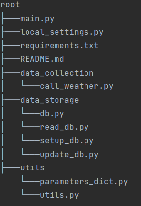

# Introduction
The Meteomatics Weather API provides a comprehensive set of weather data for various locations worldwide. The data can be used for various purposes, such as weather forecasting, climate analysis, and more. This software is a data warehouse that retrieves data from the Meteomatics Weather API, stores it in a PostgreSQL database, and provides a REST API for users to access and analyze the data.

## Technical Requirements
* Language: Python and SQL
* Framework: Django or FastAPI
* Database: PostgreSQL (at least four tables)
* Table Formats: Long and Wide (at least one of each)
* REST API: Provides access to weather data with at least four response messages

## Installation
* Check the requirements.txt and install all dependencies
* Add your Postgres and Meteomatics credentials to local_settings.py 
* Run main.py to create the database structure
* run in your console "uvicorn main:app --reload"
* Check if the connection is fine, by accessing http://localhost:8000/

## Folder Structure

## First steps
Once the API is up and running, you can access the /measures/ endpoint to retrieve environmental measurements based on a given latitude, longitude, date, and measure. To do this, make a GET request to the endpoint and provide the required parameters in the URL.

http://localhost:8000/measures/?lat=<latitude>&lon=<longitude>&startdate=<startdate>&ndays=<number of days>&measure=<measure>

Replace <latitude> and <longitude> with the coordinates for the location you're interested in, <startdate> with the start date in the format YYYYMMDD, <number of days> with the number of days you want to retrieve measurements for, and <measure> with one of the valid measures listed in the utils.valid_measures variable, like in the example below:

http://localhost:8000/measures/?lat=40.7128&lon=-74.0060&startdate=20220101&ndays=1

You will receive a JSON with complete information about the measure that you requested. For a list of the available measures, please go to http://localhost:8000/list/measures/

## Endpoints Usage

### Endpoint /measures/
This endpoint allows users to get measures data from different locations based on latitude, longitude, captions, start dates, number of days and types of measurements.

Request example:

GET /measures/?lat={lat}&lon={lon}&caption={caption}&startdate={startdate}&ndays={ndays}&measure={measure}

### Endpoint /measures/bycaption/
This endpoint allows users to get the measures data from different locations based on captions, start dates, number of days and types of measurements. The user is allowed to add caption to places when he is using the coordinates endpoint

Request example:

GET /measures/bycaption/?caption={caption}&startdate={startdate}&ndays={ndays}&measure={measure}

### Endpoint /list/measures/
This endpoint list all available measures.

GET /list/measures/

### Endpoint /list/captions/
This endpoint list all available captions.

GET /list/captions/

## Pulling data from Meteomatics API
If the data that the user requested is not available in the database, it automatically will calls the Meteomatics API to retrieve weather measures for a specific location and time period. The weather data that can be requested are wind speed, wind direction, temperature, humidity, precipitation, and cloud cover.

The call_met() function takes four parameters: the latitude and longitude coordinates of the location to retrieve data for, the number of days of data to retrieve, and the type of weather data to retrieve.

The function first translates the user's input for the weather data into the specific parameter names needed for the Meteomatics API. It then sets up the authentication credentials needed to access the API.

The function then calls the Meteomatics API to retrieve the weather data for the specified location and time period, using the parameters defined earlier. The weather data is returned in a Pandas DataFrame and then transformed in a dictionary to be inserted into DB and returned to the user.

## Database Schema
The database is structured by using SQLAlchemy. This ORM provides a way to define database tables as Python classes and their relationships as class attributes.

The database structure defined in this module consists of 7 tables:
* **Landing**: Table that stores all data pulled from Meteomatics API, independent of the measure requested.
* **Location**: Stores the latitude/longitude of the measure. It has a location_id as Primary Key, that is used by the other tables to refer to the latitude/longitude of the measure observation. This separated table for locations is important to avoid unecessary repetitions on latitude/longitude and to make the Analytical process easier by allowing efficient JOINS.
* **Temperature**: Stores temperature data. As a long table, it stores the value of the measure, its level and its unit of measure.
* **Humidity**: Stores humidity level data. As a long table, it stores the value of the measure, its level and its unit of measure.
* **Dew**: Stores dew point data. As a long table, it stores the value of the measure, its level and its unit of measure.
* **Pressure**: Stores pressure data. As a wide table, it sets one column for each group of values-units-levels.
* **Wind**: Stores wind data, including speed and direction. As a wide table, it sets one column for each group of values-units-levels.
* **Cloud**: Stores cloud cover data. As a long table, it stores the value of the measure, its level and its unit of measure.

## API Documentation

You can check the documentation from the used APIs by clicking here:
* [Fast API](https://fastapi.tiangolo.com/)
* [Meteomatics API](https://www.meteomatics.com/en/weather-api/#api-documentation)